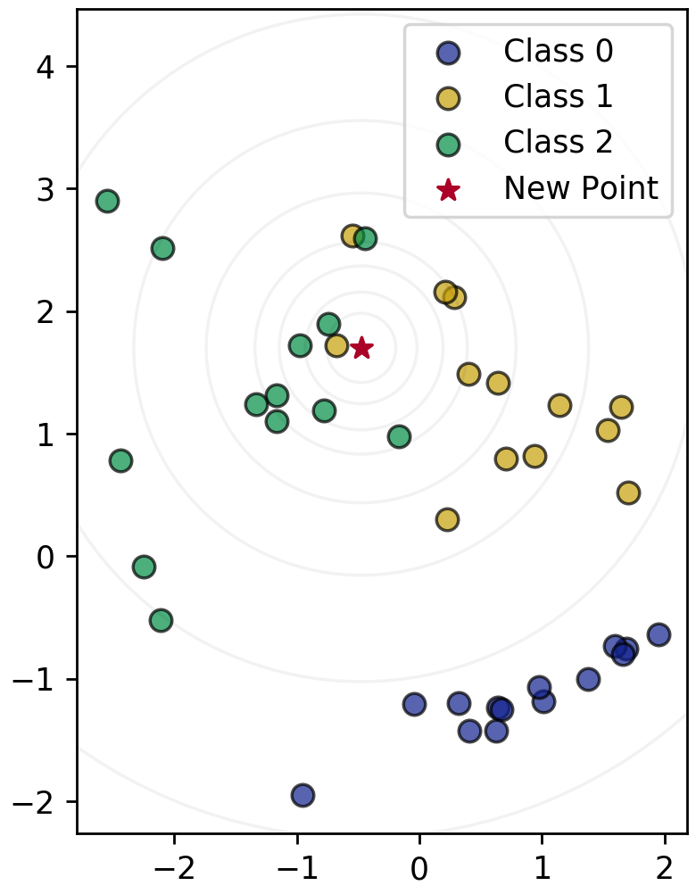

## Module 1 Quiz ##

### 1. Select the option that correctly completes the sentence:  ###

Training a model using labeled data and using this model to predict the labels for new data is known as ____________.

Density Estimation

**Supervised Learning**

Unsupervised Learning

Clustering

### 2. Select the option that correctly completes the sentence: ###

Modeling the features of an unlabeled dataset to find hidden structure is known as ____________.

Regression

Classification

Supervised Learning

**Unsupervised Learning**

### 3. Select the option that correctly completes the sentence: ###

Training a model using categorically labelled data to predict labels for new data is known as __________.

Regression

**Classification**

Clustering

Feature Extraction

### 4. Select the option that correctly completes the sentence: ###

Training a model using labelled data where the labels are continuous quantities to predict labels for new data is known as __________.

Classification

**Regression**

Feature Extraction

Clustering

### 5. Using the data for classes 0, 1, and 2 plotted below, what class would a KNeighborsClassifier classify the new point as for k = 1 and k = 3? ###

k=1: Class 0
k=3: Class 2

k=1: Class 2
k=3: Class 1

**k=1: Class 1**
**k=3: Class 2**

k=1: Class 0
k=3: Class 1

k=1: Class 1
k=3: Class 0

### 6. Which of the following is true for the nearest neighbor classifier (Select all that apply): ###

Partitions observations into k clusters where each observation belongs to the cluster with the nearest mean

Given a data instance to classify, computes the probability of each possible class using a statistical model of the input features

A higher value of k leads to a more complex decision boundary

**Memorizes the entire training set**

### 7. Why is it important to examine your dataset as a first step in applying machine learning? (Select all that apply): ###

**See what type of cleaning or preprocessing still needs to be done**

**You might notice missing data**

**Gain insight on what machine learning model might be appropriate, if any**

**Get a sense for how difficult the problem might be**

It is not important

### 8. The key purpose of splitting the dataset into training and test sets is: ###

**To estimate how well the learned model will generalize to new data**

To reduce the amount of labelled data needed for evaluating classifier accuracy

To speed up the training process

To reduce the number of features we need to consider as input to the learning algorithm

### 9. The purpose of setting the random_state parameter in train_test_split is: (Select all that apply) ###

To avoid predictable splitting of the data

To split the data into similar subsets so that bias is not introduced into the final results

To avoid bias in data splitting

**To make experiments easily reproducible by always using the same partitioning of the data**

### 10. Given a dataset with 10,000 observations and 50 features plus one label, what would be the dimensions of X_train, y_train, X_test, and y_test? Assume a train/test split of 75%/25%. ###

X_train: (2500, )
y_train: (2500, 50)
X_test: (7500, )
y_test: (7500, 50)

X_train: (10000, 50)
y_train: (10000, )
X_test: (10000, 50)
y_test: (10000, )

X_train: (10000, 28)
y_train: (10000, )
X_test: (10000, 12)
y_test: (10000, )

**X_train: (7500, 50)**
**y_train: (7500, )**
**X_test: (2500, 50)**
**y_test: (2500, )**

X_train: (2500, 50)
y_train: (2500, )
X_test: (7500, 50)
y_test: (7500, )
