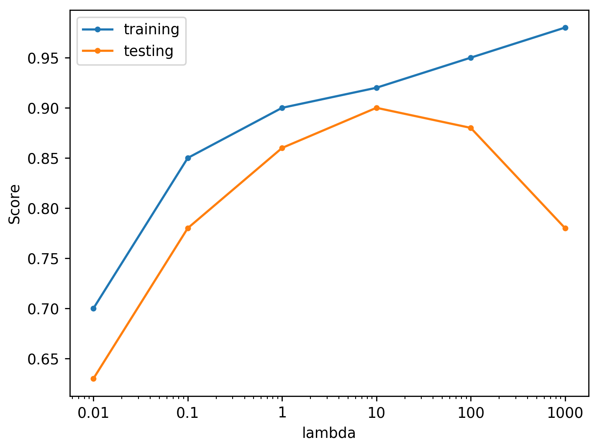
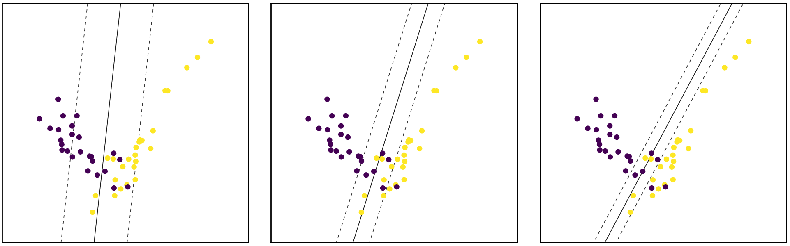
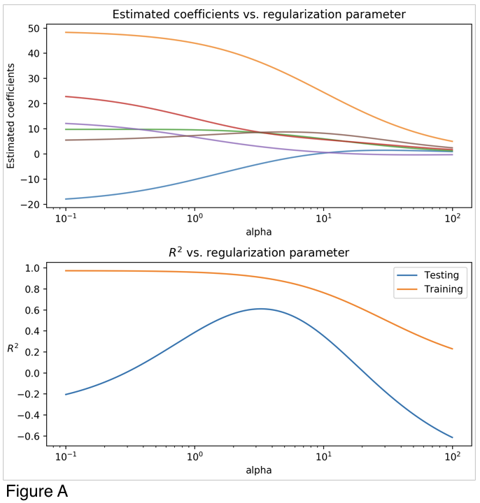

## Module 2 Quiz ##

### 1. After training a ridge regression model, you find the the training and test set accuracies are 0.98 and 0.54 respectively. Which of the following would be the best choice for the next ridge regression model you train? ###

You are overfitting, the next model trained should have a lower value for alpha

**You are overfitting, the next model trained should have a higher value for alpha**

You are underfitting, the next model trained should have a lower value for alpha

You are underfitting, the next model trained should have a higher value for alpha

### 2. After training a Radial Basis Function (RBF) kernel SVM, you decide to increase the influence of each training point and to simplify the decision surface. Which of the following would be the best choice for the next RBF SVM you train? ###

**Decrease C and gamma**

Increase C and gamma

Increase C, decrease gamma

Decrease C, increase gamma

### 3. Which of the following is an example of multiclass classification? (Select all that apply) ###

**Classify a set of fruits as apples, oranges, bananas, or lemons**

Predict whether an article is relevant to one or more topics (e.g. sports, politics, finance, science)

Predicting both the rating and profit of soon to be released movie

Classify a voice recording as an authorized user or not an authorized user.

### 4. Looking at the plot below which shows accuracy scores for different values of a regularization parameter lambda, what value of lambda is the best choice for generalization? ###

10

### 5. Suppose you are interested in finding a parsimonious model (the model that accomplishes the desired level of prediction with as few predictor variables as possible) to predict housing prices. Which of the following would be the best choice? ###

Ordinary Least Squares Regression

Ridge Regression

**Lasso Regression**

Logistic Regression

### 6. Match the plots of SVM margins below to the values of the C parameter that correspond to them. ###

**0.1, 1, 10**

10, 1, 0.1

1, 0.1, 10

10, 0.1, 1

### 7. Use Figures A and B below to answer questions 7, 8, 9, and 10. ###

Looking at the two figures (Figure A, Figure B), determine which linear model each figure corresponds to:

**Figure A: Ridge Regression, Figure B: Lasso Regression**

Figure A: Lasso Regression, Figure B: Ridge Regression

Figure A: Ordinary Least Squares Regression, Figure B: Ridge Regression

Figure A: Ridge Regression, Figure B: Ordinary Least Squares Regression

Figure A: Ordinary Least Squares Regression, Figure B: Lasso Regression

Figure A: Lasso Regression, Figure B: Ordinary Least Squares Regression

### 8. Looking at Figure A and B, what is a value of alpha that optimizes the R2 score for the Ridge Model? ###

3

### 9. Looking at Figure A and B, what is a value of alpha that optimizes the R2 score for the Lasso Model? ###

10

### 10. When running a LinearRegression() model with default parameters on the same data that generated Figures A and B the output coefficients are: ###
| Coef 0	| -19.5
| Coef 1	| 48.8
| Coef 2	| 9.7
| Coef 3	| 24.6
| Coef 4	| 13.2
| Coef 5	| 5.1

For what value of Coef 3 is R2 score maximized for the Lasso Model?

0

### 11. Which of the following is true of cross-validation? (Select all that apply) ###

Increases generalization ability and reduces computational complexity

**Helps prevent knowledge about the test set from leaking into the model**

**Fits multiple models on different splits of the data**

Removes need for training and test sets

**Increases generalization ability and computational complexity**

