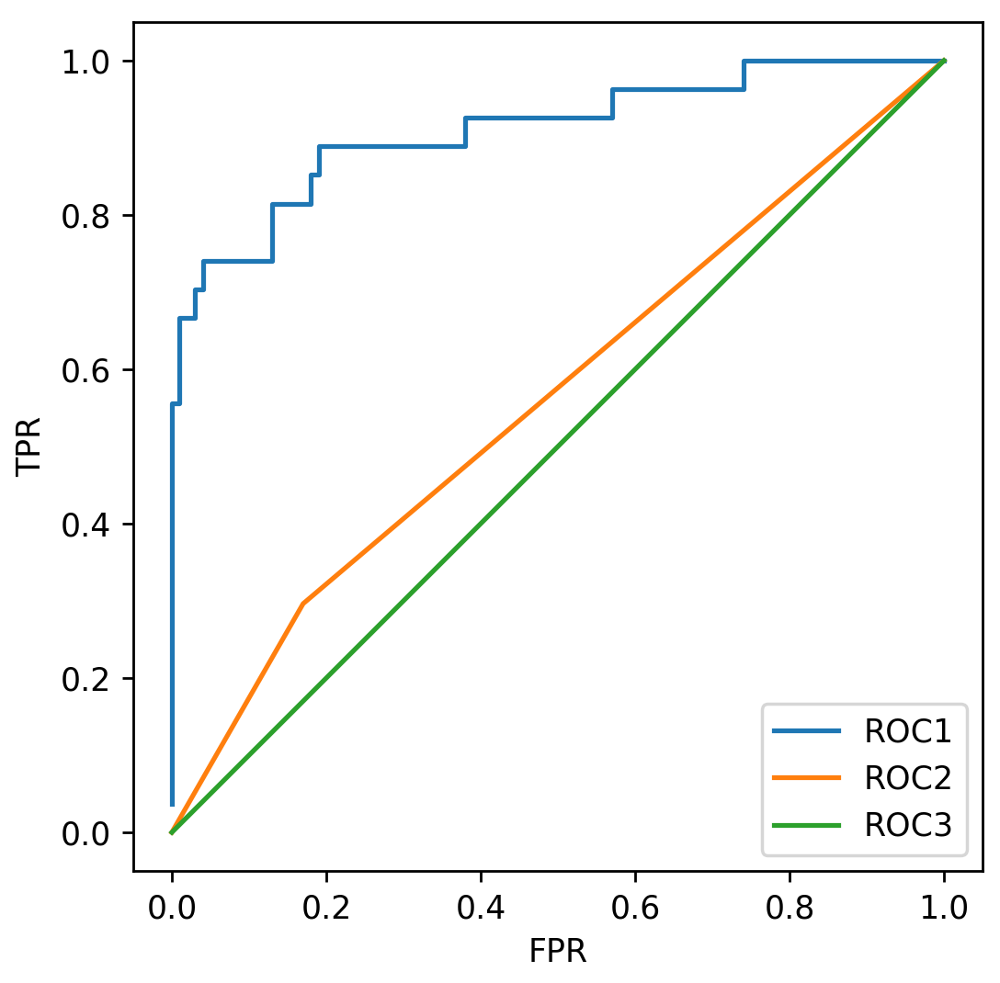

## Module 3 Quiz ##

### 1. A supervised learning model has been built to predict whether someone is infected with a new strain of a virus. The probability of any one person having the virus is 1%. Using accuracy as a metric, what would be a good choice for a baseline accuracy score that the new model would want to outperform? ###

0.99

### 2. Given the following confusion matrix: ###
					| Predicted Positive 	| Predicted Negative
Condition Positive	| 96					| 4
Condition Negative	| 8						| 19

Compute the accuracy to three decimal places.

0.905

### 3. Given the following confusion matrix: ###
					| Predicted Positive 	| Predicted Negative
Condition Positive	| 96					| 4
Condition Negative	| 8						| 19

Compute the precision  to three decimal places.

0.923

### 4. Given the following confusion matrix: ###
					| Predicted Positive 	| Predicted Negative
Condition Positive	| 96					| 4
Condition Negative	| 8						| 19

Compute the recall  to three decimal places.

0.96

### 5.  ###
Using the fitted model `m` create a precision-recall curve to answer the following question:

For the fitted model `m`, approximately what precision can we expect for a recall of 0.8?

(Use y_test and X_test to compute the precision-recall curve. If you wish to view a plot, you can use `plt.show()` )

0.6

y_scores_lr = m.fit(X_train, y_train).decision_function(X_test)

from sklearn.metrics import precision_recall_curve

precision, recall, thresholds = precision_recall_curve(y_test, y_scores_lr)

plt.figure()
plt.xlim([0.0, 1.01])
plt.ylim([0.0, 1.01])
plt.plot(precision, recall, label='Precision-Recall Curve')
plt.xlabel('Precision', fontsize=16)
plt.ylabel('Recall', fontsize=16)
plt.axes().set_aspect('equal')
plt.show()

### 6. Given the following models and AUC scores, match each model to its corresponding ROC curve. ###

- Model 1 test set AUC score: 0.91
- Model 2 test set AUC score: 0.50
- Model 3 test set AUC score: 0.56

Model 1: Roc 1
Model 2: Roc 2
Model 3: Roc 3

**Model 1: Roc 1**
**Model 2: Roc 3**
**Model 3: Roc 2**

Model 1: Roc 2
Model 2: Roc 3
Model 3: Roc 1

Model 1: Roc 3
Model 2: Roc 2
Model 3: Roc 1

Not enough information is given.

### 7. Given the following models and accuracy scores, match each model to its corresponding ROC curve. ###

- Model 1 test set accuracy: 0.91
- Model 2 test set accuracy: 0.79
- Model 3 test set accuracy: 0.72

Model 1: Roc 1
Model 2: Roc 2
Model 3: Roc 3

Model 1: Roc 1
Model 2: Roc 3
Model 3: Roc 2

Model 1: Roc 2
Model 2: Roc 3
Model 3: Roc 1

Model 1: Roc 3
Model 2: Roc 2
Model 3: Roc 1

**Not enough information is given.**

### 8.  ###
Using the fitted model `m` what is the micro precision score?

(Use y_test and X_test to compute the precision score.)

0.74

svm_predicted = m.predict(X_test)

print('Micro-averaged precision = {:.3f} (treat instances equally)'
      .format(precision_score(y_test, svm_predicted, average = 'micro')))
	  
### 9. Which of the following is true of the R-Squared metric? (Select all that apply) ###

**The best possible score is 1.0**

A model that always predicts the mean of y would get a score of 0.0

**The worst possible score is 0.0**

A model that always predicts the mean of y would get a negative score

### 10. In a future society, a machine is used to predict a crime before it occurs. If you were responsible for tuning this machine, what evaluation metric would you want to maximize to ensure no innocent people (people not about to commit a crime) are imprisoned (where crime is the positive label)? ###

Accuracy

**Precision**

Recall

F1

AUC

### 11. Consider the machine from the previous question. If you were responsible for tuning this machine, what evaluation metric would you want to maximize to ensure all criminals (people about to commit a crime) are imprisoned (where crime is the positive label)? ###

Accuracy

Precision

**Recall**

F1

AUC

### 12. A classifier is trained on an imbalanced multiclass dataset. After looking at the model’s precision scores, you find that the micro averaging is much smaller than the macro averaging score. Which of the following is most likely happening? ###

The model is probably misclassifying the infrequent labels more than the frequent labels.

**The model is probably misclassifying the frequent labels more than the infrequent labels.**

### 13. Using the already defined RBF SVC model `m`, run a grid search on the parameters C and gamma, for values [0.01, 0.1, 1, 10]. The grid search should find the model that best optimizes for recall. How much better is the recall of this model than the precision? (Compute recall - precision to 3 decimal places) ###

(Use y_test and X_test to compute precision and recall.)

0.52

grid_values = {'gamma': [0.01, 0.1, 1, 10], 'C': [0.01, 0.1, 1, 10]}

from sklearn.model_selection import GridSearchCV

grid_clf_acc = GridSearchCV(m, param_grid = grid_values, scoring='recall')
grid_clf_acc.fit(X_train, y_train)
y_decision_fn_scores_acc = grid_clf_acc.decision_function(X_test) 

print('Grid best parameter (max. accuracy): ', grid_clf_acc.best_params_)
print('Grid best score (accuracy): ', grid_clf_acc.best_score_)

y_predicted = grid_clf_acc.predict(X_test)

from sklearn.metrics import precision_score, recall_score
# Precision = TP / (TP + FP)
# Recall = TP / (TP + FN)  Also known as sensitivity, or True Positive Rate
print('Precision: {:.3f}'.format(precision_score(y_test, y_predicted)))
print('Recall: {:.3f}'.format(recall_score(y_test, y_predicted)))

### 14. Using the already defined RBF SVC model `m`, run a grid search on the parameters C and gamma, for values [0.01, 0.1, 1, 10]. The grid search should find the model that best optimizes for precision. How much better is the precision of this model than the recall? (Compute precision - recall to 3 decimal places) ###

(Use y_test and X_test to compute precision and recall.)

0.15

grid_values = {'gamma': [0.01, 0.1, 1, 10], 'C': [0.01, 0.1, 1, 10]}

from sklearn.model_selection import GridSearchCV

grid_clf_acc = GridSearchCV(m, param_grid = grid_values, scoring='precision')
grid_clf_acc.fit(X_train, y_train)
y_decision_fn_scores_acc = grid_clf_acc.decision_function(X_test) 

print('Grid best parameter (max. accuracy): ', grid_clf_acc.best_params_)
print('Grid best score (accuracy): ', grid_clf_acc.best_score_)

y_predicted = grid_clf_acc.predict(X_test)

from sklearn.metrics import precision_score, recall_score
# Precision = TP / (TP + FP)
# Recall = TP / (TP + FN)  Also known as sensitivity, or True Positive Rate
print('Precision: {:.3f}'.format(precision_score(y_test, y_predicted)))
print('Recall: {:.3f}'.format(recall_score(y_test, y_predicted)))

